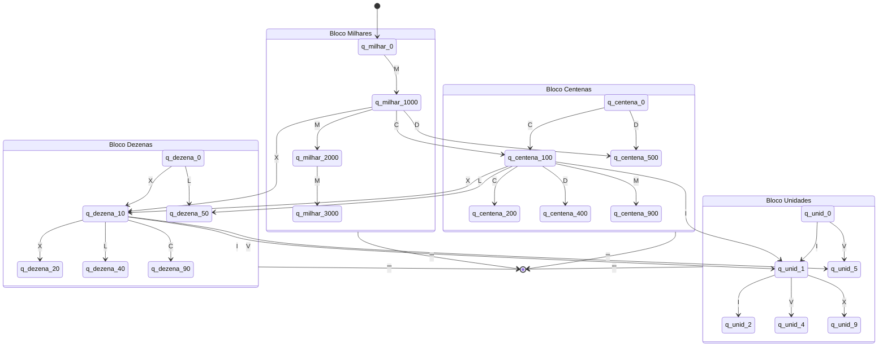

### Diagrama de Estados (Mermaid)

## Nota:
 Para fins de clareza visual, o diagrama apresenta as transições principais. As repetições subsequentes (como 300, 700, 800, e os outros) seguem a mesma lógica determinística apresentada nas transições base.