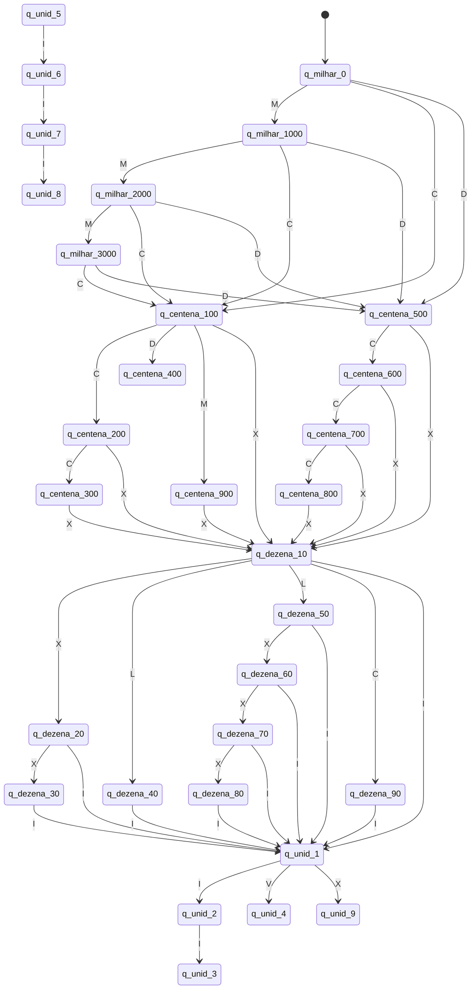

# Modelagem do Autômato

Este documento apresenta a **modelagem do Autômato Finito Determinístico (AFD)** utilizado no projeto de conversão de números romanos para decimais.

A máquina foi implementada como um **Transdutor de Moore**, no qual a saída depende exclusivamente do **estado atual**.

---

# Organização do Autômato

O autômato foi organizado em quatro blocos principais:

1. Milhares
2. Centenas
3. Dezenas
4. Unidades

Cada bloco representa uma **magnitude decimal**, e os estados indicam o valor acumulado daquela magnitude.

---

# Diagrama do Autômato

---

# Interpretação do Diagrama

Cada estado representa um **valor semântico da tradução**.

Por exemplo:

| Estado        | Valor emitido |
| ------------- | ------------- |
| q_milhar_1000 | 1000          |
| q_centena_500 | 500           |
| q_dezena_40   | 40            |
| q_unid_9      | 9             |

Sempre que a máquina entra em um estado, o valor associado é emitido conforme a função de saída **λ (lambda)** do modelo de Moore.

---

# Observação Teórica

Em um **Transdutor de Moore**:

* a função de saída depende **somente do estado**
* não depende do símbolo de entrada

Formalmente:

λ : Q → Γ

Essa característica torna a modelagem particularmente adequada para **conversores de representação numérica**, pois cada estado pode representar diretamente uma magnitude decimal.

---

# Conclusão

A modelagem apresentada garante:

* determinismo
* validação sintática dos numerais romanos
* conversão correta para decimal
* aderência ao modelo formal de **Transdutor de Moore**

O autômato aceita cadeias válidas no intervalo de **1 a 3999** e rejeita cadeias que não obedecem às regras da numeração romana clássica.
